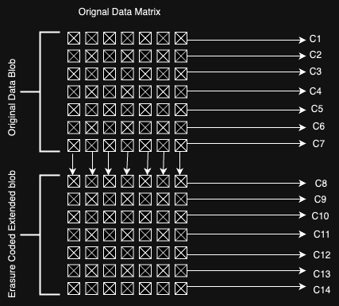

# Erasure Coding and KZG Commitments in Avail

## Erasure Coding

Erasure Coding was originally designed to ensure that any downtime or machine failure does not result in data loss by placing a redundancy mechanism. Consider a blob of data that can be split into 4 pieces: D1, D2, D3, and D4. In this case, we generate two linear equations, P1 and P2, by combining the data blocks. The system is resistant to the loss of two data blocks since P1 and P2 use the 4 data pieces. If we know 2 of them, we can recover the lost data by solving the two linear equations (since only 2 variables are unknown) and recover the lost data.

To extend this to practical implementation, we use Galois Field for large amounts of data. This scheme is the foundation of Erasure Coding. Data is cut into `n` chunks, and parities are erasure code. The number of parity blocks corresponds to the number of failures the system can resist. For example, if \( N = 4 \) and \( P = 2 \), the system can resist up to 2 failures, similar to triple replication but at 50% overhead compared to 200% with triple replication.

Avail leverages the fact that information can be reconstructed from these chunks. Erasure coding makes the data availability sampling technique much more powerful.

## KZG Commitment

A KZG (Kate-Zaverucha-Goldberg) commitment is a type of polynomial commitment scheme that allows one to commit to a polynomial and later prove, in a succinct way, that the committed polynomial evaluates to a certain value at a given point. The key properties of KZG commitments are their efficiency, succinctness, and the ability to support batched openings and zero-knowledge proofs.

Blobs in Avail are stored in a matrix, where any data corresponding to an app id is stored as `(start_cell, length)`, with traversal being done in an RC manner. Data for each row in the corresponding matrix is committed using the KZG polynomial commitment scheme in Avail, and also erasure coded \( 2n \) rows where \( n \) is the number of rows (usually 256) in a blob of data.

A special property of KZG commitment is that if, let's say, a polynomial \( P1 \) is constructed using \( N \) points, and if those \( N \) points are erasure coded, the resulting points also lie on the same polynomial. This property of KZG is exploited to create a linkability between the commitment and erasure coding done, hence giving a cryptographic guarantee that erasure coding itself was done correctly. This property makes Avail a validity proof-based design.

## 

### KZG Poly-commit scheme

#### What is a commitment ?

A commitment is a cryptographic concept used to ensure the integrity and confidentiality of data in various cryptographic protocols. It is often used in scenarios where one party wants to commit to a chosen value while keeping it hidden from others, and later reveal the value in a way that proves it was not altered.
The commitment scheme involves two main phases:

1. **Commit Phase**: The committer chooses a value and generates a commitment using a commitment function. The commitment is then sent to the verifier. The commitment hides the chosen value but binds the committer to it.

2. **Reveal Phase**: The committer later reveals the chosen value and the randomness used in the commitment function. The verifier can then check that the revealed value matches the commitment.

A commitment scheme should have two key properties:

1. **Binding**: It should be infeasible for the committer to change the committed value after the commitment has been made. This ensures the integrity of the commitment.

2. **Hiding**: It should be infeasible for the verifier to learn anything about the committed value before it is revealed. This ensures the confidentiality of the commitment.

Commitments are widely used in cryptographic protocols such as zero-knowledge proofs, secure multiparty computation, and blockchain technologies to ensure data integrity and privacy.

#### A KZG polynomial commitment scheme

Allows a prover to commit to a polynomial so that they can later reveal and prove properties about the polynomial (like its value at certain points) without revealing the entire polynomial. This is particularly useful in scenarios where the polynomial represents some private data or computation.

Before we start, let’s see the elements we have:

- Bilinear Group $p$, $G$, $g$, $G_t$, $e$
- Univariate polynomials: $F = F_p^{\leq d}[X]$

#### Step 1: Keygen

- Sample random $\tau \in F_p$
- $\text{gp} = (g, g^{\tau}, g^{\tau^2}, \ldots, g^{\tau^d})$
- delete $\tau$ (trusted setup)

#### Step 2: Commit

- $\text{commit} (\text{gp}, f) \rightarrow \text{com}_f$
- $f(x) = f_0 + f_1 x + f_2 x^2 + \ldots + f_d x^d$
- $\text{com}_f = g^{f(\tau)}$
  $= g^{f_0 + f_1 \tau + f_2 \tau^2 + \ldots + f_d \tau^d}$
  $= (g)^{f_0} (g^{\tau})^{f_1} (g^{\tau^2})^{f_2} \ldots (g^{\tau^d})^{f_d}$

#### Step 3: Proof

- $\text{eval}(\text{gp}, f, u) \rightarrow v, \pi$: where $u$ is a random point the verifier chooses.
  - $f(x) - f(u) = (x - u) q(x)$ as $u$ is a root of $f(x) - f(u)$
  - Compute $q(x)$ and $\pi = g^{q(\tau)}$ computed using $\text{gp}$ elements.

#### Step 4: Verify

- $verify(gp, com_f, u, v, \pi)$:
  - where $v = f(u)$
  - The idea is to check the equation at point $\tau$: $g^{f(\tau) - f(u)} = g^{(\tau - u)q(\tau)}$
  - Challenge: only know $g^{\tau - u}$ and $g^{q(\tau)}$
  - Solution: pairings - $e(com_f / g^v, g) = e(g^{\tau - u}, \pi)$
    $= e(g, g)^{f(\tau) - f(u)} = e(g, g)^{(\tau - u)q(\tau)}$

---

#### Batch opening: Multiple Polynomials

- Prover wants to prove $f_i(u_{i,j}) = v_{i,j}$ for $i \in [n]$ and $j \in [m_i]$
- Steps:
  - For each polynomial $f_i$:
    - Extrapolate $f_i(u_{i,1}), \ldots, f_i(u_{i,m_i})$ to get $h_i(x)$
    - $f_i(x) - h_i(x) = \prod_{j=1}^{m_i}(x - u_{i,j})q_i(x)$
  - Combine all $q_i(x)$ via a random linear combination:
    - Let $r_1, \ldots, r_n$ be random scalars
    - $Q(x) = \sum_{i=1}^n r_i q_i(x)$
  - Compute $\pi = g^{Q(\tau)}$
  - Verify: $e(\prod_{i=1}^n com_{f_i}^{r_i} / g^{\sum_{i=1}^n r_i h_i(\tau)}, g) = e(g^{\sum_{i=1}^n r_i \prod_{j=1}^{m_i}(\tau - u_{i,j})}, \pi)$
